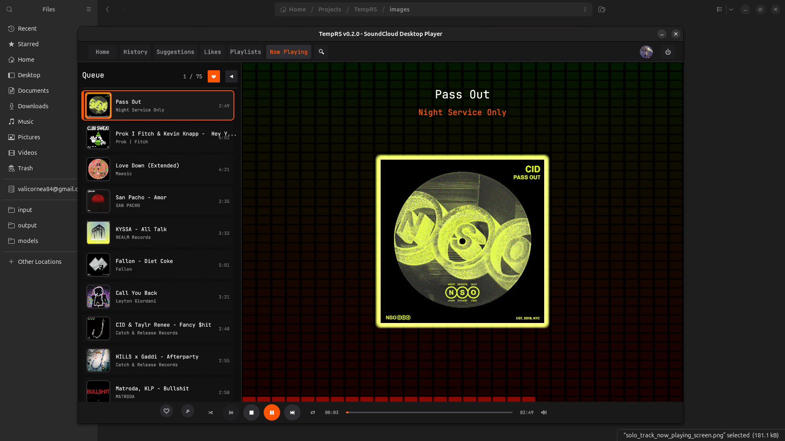

# TempRS - SoundCloud Desktop Player

A Rust-based desktop music player for SoundCloud with progressive audio streaming.



> 📸 **[View all screenshots and detailed feature documentation →](images/README.md)**

## ⚠️ Setup Required

**Before building**: You need SoundCloud API credentials. See [CREDENTIALS_SETUP.md](CREDENTIALS_SETUP.md) for instructions.

The repository ships with dummy credentials that won't work - replace them in `src/main.rs`:
```rust
pub const SOUNDCLOUD_CLIENT_ID: &str = "YOUR_CLIENT_ID_HERE";
pub const SOUNDCLOUD_CLIENT_SECRET: &str = "YOUR_CLIENT_SECRET_HERE";
```

## Features

✅ **Progressive Audio Streaming**
- Streams audio directly from SoundCloud CDN without downloading full files
- Uses minimp3 for real-time MP3 decoding
- Low memory footprint (~2MB buffer with 5MB limit)
- Instant playback start
- Buffering state tracking & timeout detection (5s)

✅ **Smart Caching**
- Hybrid filesystem + SQLite metadata caching
- Artwork caching with placeholder tracking (prevents retry loops)
- Auto-cleanup (30 days + 100GB limit)
- No audio file storage (pure streaming)

✅ **Playback Controls**
- Play/Pause/Stop
- Next/Previous track
- Shuffle & Repeat modes
- Seeking (restarts stream at offset)
- Volume control with vertical popup slider
- Mute/unmute (right-click speaker icon)

✅ **Library Management**
- Like/unlike tracks (synced with SoundCloud API)
- Like/unlike playlists (synced with SoundCloud API)
- Playback history tracking (local SQLite database)
- Recently played tracks (no API calls needed)

✅ **Authentication**
- OAuth 2.0 with PKCE
- Machine-bound encrypted token storage (AES-256-GCM)
- Auto token refresh
- Machine fingerprinting (CPU + machine ID)

## Technical Stack

- **UI**: egui 0.33 / eframe (with wgpu backend)
- **Audio**: rodio 0.19 + minimp3 0.5
- **HTTP**: reqwest 0.12 (with streaming support)
- **Async**: tokio 1.43
- **Storage**: rusqlite 0.32 (encrypted tokens, cache metadata, playback history)
- **Encryption**: AES-256-GCM (ring crate)
- **Shaders**: WGSL via egui-wgpu integration

## Build & Run

```bash
cargo build --release
./target/release/TempRS
```

## How Streaming Works

1. Request stream URL from SoundCloud API (with OAuth)
2. Follow redirect to actual CDN URL (cf-media.sndcdn.com)
3. Stream audio in chunks via HTTP
4. Decode MP3 frames progressively with minimp3
5. Feed decoded samples to rodio for playback
6. Track sent frames to avoid re-sending duplicates

### Seeking Implementation
- Stops current stream
- Calculates byte offset (assumes 128kbps MP3 ≈ 16KB/s)
- Requests fresh redirect URL
- Starts new stream with Range header from offset
- Resumes playback

## Recent Changes (2025-12-02)

### ✅ Volume Control Enhancement
- Replaced horizontal slider with vertical popup (140px tall)
- Click speaker icon to toggle popup
- Right-click speaker to mute/unmute
- Clean UI with shadow layers and orange accent

### ✅ Graceful Shutdown System
- Proper cleanup of audio resources
- Saves playback settings on exit
- Clears receivers, textures, and caches
- No confirmation dialog (direct cleanup)

### ✅ Audio Sync Improvements
- Added buffering state tracking (prevents premature "finished" detection)
- 5-second timeout detection for stuck streams
- Buffer management: 5MB limit with 2MB trim when exceeded
- Fixed rare endless stuck/choppy audio issues

### ✅ Like/Unlike Functionality
- Track like/unlike from Likes screen and player footer
- Playlist like/unlike from Playlists tab
- Optimistic UI updates with background API sync
- Heart icons: ❤ (liked) / 💔 (unliked)
- Red hover effect on unlike buttons

### ✅ UI/UX Polish
- Removed duplicate badges from track cards
- Character encoding fixes (× → x/X)
- Toast notifications: text-only (no emojis)
- Broken heart icon for unliked state

### ✅ Git Repository
- Remote: `ssh://gitea@gitea.home.cornfield/nobus/TempRS.git`
- All changes committed and pushed

## Project Structure

```
src/
├── app/
│   ├── player_app.rs      # Main app state & orchestration
│   ├── queue.rs            # Playback queue management
│   └── playlists.rs        # Playlist data models
├── ui_components/
│   ├── header.rs           # Top navigation bar
│   ├── layout.rs           # Shared layout wrapper (header/footer/sidebar)
│   ├── player.rs           # Playback controls footer
│   ├── playlist_sidebar.rs # Queue sidebar with track list
│   └── helpers.rs          # UI utility functions
├── screens/
│   ├── splash.rs           # Splash screen with WGSL shader
│   ├── likes.rs            # Liked tracks with unlike buttons
│   ├── playlists.rs        # User playlists (legacy - unused)
│   ├── user_playlists.rs   # Playlists tab with unlike buttons
│   ├── history.rs          # Playback history view
│   └── home/               # Home screen modules
│       ├── recently_played.rs
│       ├── recommendations.rs
│       └── suggestions.rs
├── api/
│   ├── likes.rs            # Like/unlike tracks & playlists
│   ├── playlists.rs        # Playlist fetching
│   ├── tracks.rs           # Track streaming & metadata
│   └── search.rs           # Search endpoints
├── utils/
│   ├── audio_controller.rs # Audio thread management
│   ├── mediaplay.rs        # Streaming & MP3 decoding
│   ├── oauth.rs            # OAuth 2.0 + PKCE flow
│   ├── token_store.rs      # AES-256-GCM encrypted storage
│   ├── fingerprint.rs      # Machine fingerprinting
│   ├── cache.rs            # Hybrid caching (filesystem + DB)
│   ├── playback_history.rs # Local playback tracking
│   └── shader.rs           # WGSL shader pipeline
└── shaders/
    └── splash_bg.wgsl      # Splash screen background shader
```

## Cache Locations

- **Tokens**: `~/.config/TempRS/tokens.db` (AES-256-GCM encrypted)
- **Cache DB**: `~/.cache/TempRS/cache.db` (metadata: URLs, hashes, timestamps)
- **Artwork**: `~/.cache/TempRS/artwork/` (SHA256-named files)
- **Sidebar Artwork**: `~/.cache/TempRS/sidebar_artwork/`
- **Playback History**: `~/.config/TempRS/playback_history.db` (local tracking)
- **No audio files stored** (streaming only)

## Key Architecture Patterns

### Threading Model
- **Main thread**: Synchronous egui update loop
- **Background tasks**: `std::thread::spawn` + `tokio::Runtime::new().block_on()`
- **Communication**: `mpsc::channel` for results, `Arc<Mutex<T>>` for shared state
- **Memory management**: Explicit `drop()` for immediate resource cleanup

### Audio Streaming
- HTTP streaming with live MP3 decoding (minimp3)
- Frame-index tracking to avoid duplicate sends
- Buffering threshold: 44100 samples (~1 second)
- 5-second timeout detection for stuck streams
- Buffer limits: 5MB max, trims to 2MB when exceeded

### Caching Strategy
- **Filesystem**: Actual files (artwork, thumbnails)
- **SQLite**: Metadata (URLs, hashes, cache status, placeholder flags)
- **Placeholder tracking**: Prevents retry loops for 404s
- **Auto-cleanup**: 30 days + 100GB limit enforced at startup

## Dependencies

- Pure Rust (cross-platform)
- No external audio libraries required
- minimp3: ~50KB addition to binary
- All dependencies statically linked

## License

See project license file.
