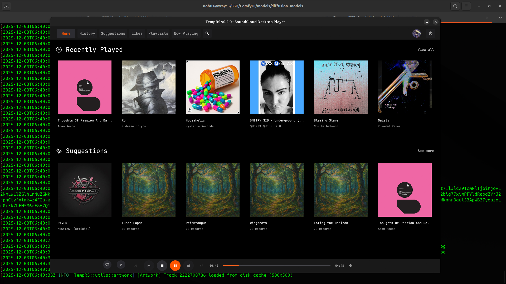
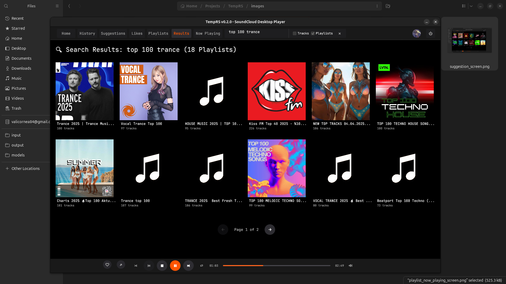
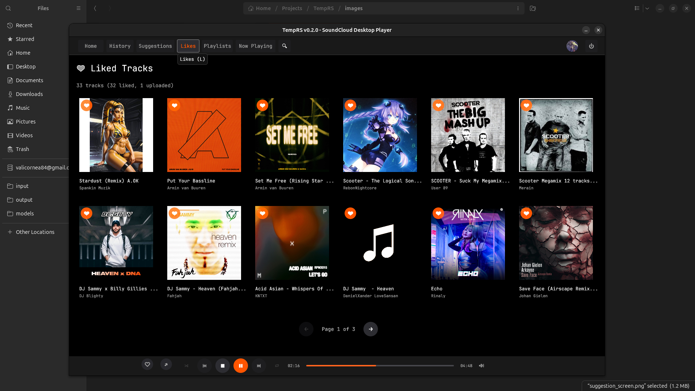
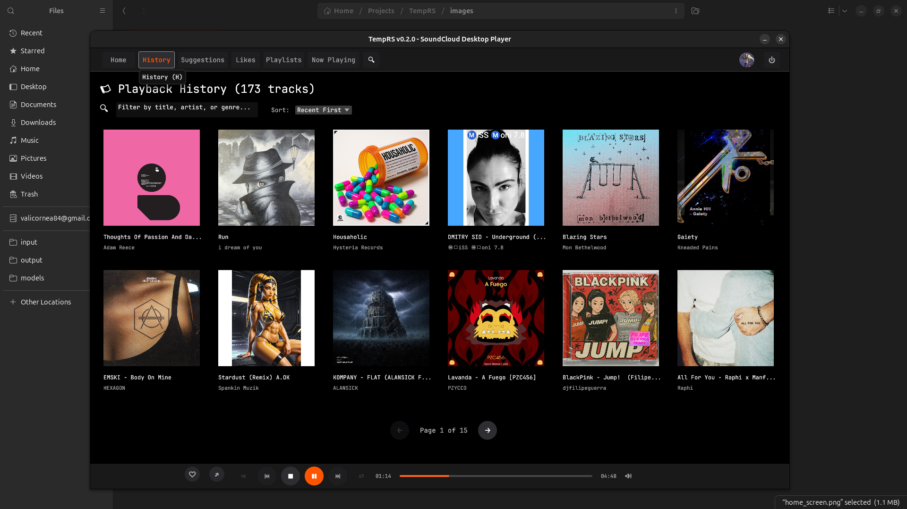
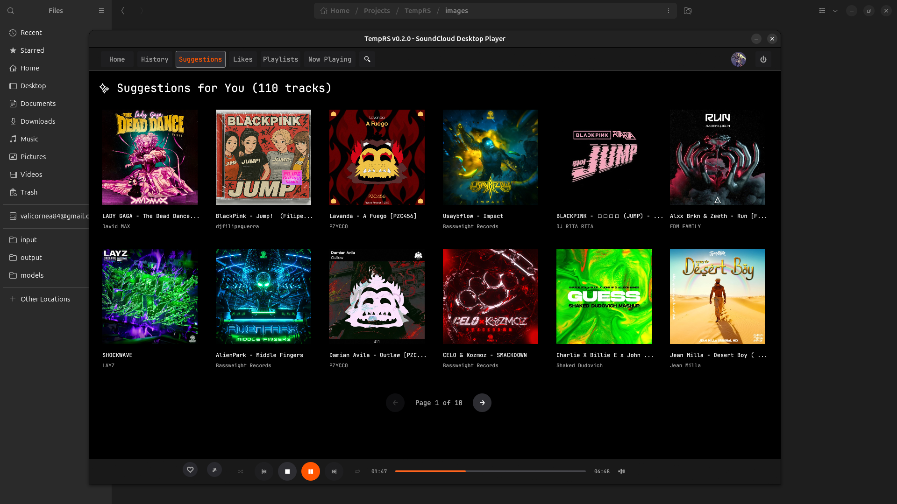
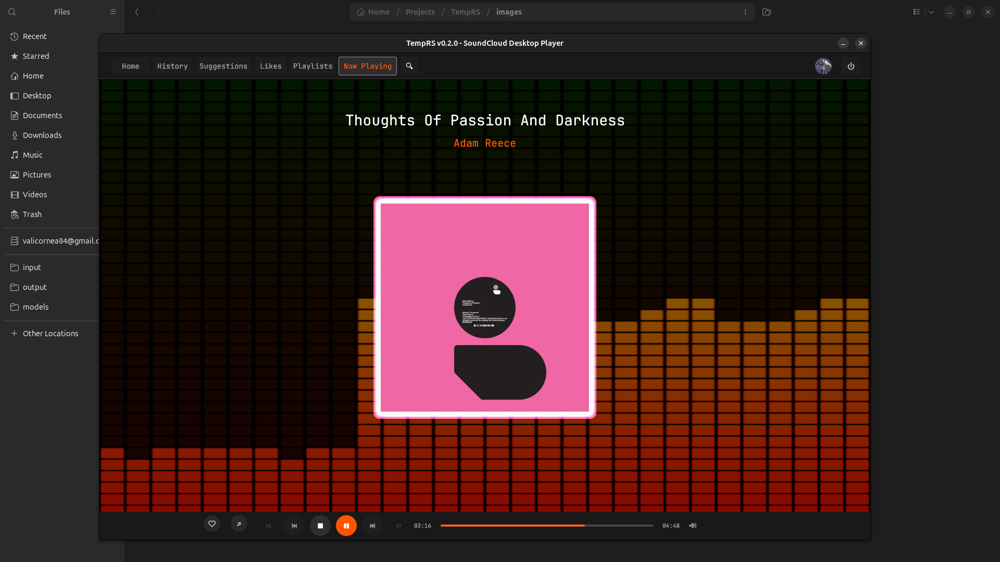

# TempRS Screenshots & Feature Overview

Visual guide to all screens with implemented features and areas for improvement.

---

## 01 - Home Screen


**Features:**
- Recently Played section (from local database)
- Personalized Recommendations (based on recent tracks)
- Track cards with artwork, title, artist
- Click to play, Shift+Click to queue all

**To Improve:**
- [ ] Add "Refresh Recommendations" button
- [ ] Show play count or date for recently played
- [ ] Add horizontal scroll for large collections
- [ ] Genre filtering for recommendations
- [ ] "Clear History" button for recently played

---

## 02 - Search Screen


**Features:**
- Real-time search (tracks & playlists)
- Tab switching (Tracks/Playlists)
- Pagination with page controls
- Grid layout for results
- Click to play/open playlist

**To Improve:**
- [ ] Add search filters (genre, duration, upload date)
- [ ] Sort options (relevance, plays, date)
- [ ] "Load More" infinite scroll option
- [ ] Search history/suggestions
- [ ] User search tab
- [ ] Advanced search syntax support

**Search Mechanism:**
- Uses SoundCloud API `/search` endpoint
- Debounced input (prevents spam)
- 18 results per page
- Separate endpoints for tracks vs playlists

---

## 03 - Likes Screen


**Features:**
- Display all liked tracks from SoundCloud
- Like/unlike functionality with heart button
- Orange heart for liked tracks
- Pagination (12 tracks per page)
- Track artwork caching
- Click to play single track or queue all

**To Improve:**
- [ ] Bulk actions (unlike multiple)
- [ ] Sort options (date liked, artist, title)
- [ ] Filter by genre/artist
- [ ] Export liked tracks list
- [ ] Sync status indicator
- [ ] Search within likes

**Pagination System:**
- Page size: 12 tracks
- `likes_page` and `likes_page_size` state variables
- Previous/Next buttons with page counter
- Auto-clamps to valid page range
- Uses `render_pagination_controls()` helper

---

## 04 - Playlists Screen


**Features:**
- User-created playlists
- Liked playlists (from other users)
- Like/unlike playlists (heart button only on non-owned)
- Pagination (12 playlists per page)
- Track count display
- Click playlist to view tracks in sidebar

**To Improve:**
- [ ] Create new playlist functionality
- [ ] Edit playlist (add/remove tracks)
- [ ] Playlist cover customization
- [ ] Reorder playlists
- [ ] Delete playlist option
- [ ] Playlist sharing/export
- [ ] Sort by name, date, track count

**Pagination System:**
- Same as Likes screen (12 per page)
- Distinguishes user-created vs liked playlists
- Heart icon only shown for others' playlists

---

## 05 - History Screen


**Features:**
- Local playback history (SQLite database)
- Pagination with configurable page size
- Search/filter tracks by title, artist, genre
- Sort options (Recent First, Oldest First, Title A-Z, Artist A-Z)
- No API calls required (all local)
- Click to replay track

**To Improve:**
- [ ] Date range filter
- [ ] Play count per track
- [ ] Export history to CSV/JSON
- [ ] Clear history button
- [ ] Group by date/artist
- [ ] Statistics view (most played, total time)

**Pagination System:**
- Database-level pagination (efficient for large history)
- `history_page`, `history_page_size`, `history_total_tracks`
- Uses `get_recent_tracks_paginated(limit, offset)`
- Search filters applied before pagination

---

## 06 - Suggestions Screen


**Features:**
- Combined data sources (priority order):
  1. API recommendations
  2. Liked tracks
  3. Playback history
- Automatic deduplication (no repeated tracks)
- Pagination (12 tracks per page)
- Handles tracks without stream URLs (fetches on demand)

**To Improve:**
- [ ] User preference weighting (more likes vs history)
- [ ] "Why this suggestion?" explanation
- [ ] Refresh suggestions manually
- [ ] Filter by mood/genre
- [ ] Time-based suggestions (morning/evening playlists)
- [ ] Similar artists discovery

**Pagination System:**
- Uses `get_combined_suggestions()` to merge sources
- `suggestions_page` and `suggestions_page_size` (12 per page)
- Checks `stream_url` presence, calls `fetch_and_play_track()` if missing

---

## 07 - Now Playing (Single Track)


**Features:**
- Large album artwork display
- Track title, artist, duration
- Progress bar with seek functionality
- Playback controls (play/pause, next/prev)
- Volume slider (vertical popup)
- Shuffle/Repeat toggles
- Like/unlike button

**To Improve:**
- [ ] Track waveform visualization
- [ ] Lyrics display (if available)
- [ ] Related tracks sidebar
- [ ] Share track functionality
- [ ] Add to playlist button
- [ ] Track info (genre, upload date, plays)

---

## 08 - Now Playing (Playlist/Queue)


**Features:**
- Full queue visible in sidebar
- Current track highlighted
- Collapsible queue sidebar
- Drag-to-reorder (not yet implemented)
- Queue management (shuffle affects order)
- Album artwork for current track

**To Improve:**
- [ ] Drag-and-drop track reordering
- [ ] Remove tracks from queue
- [ ] Save queue as playlist
- [ ] Clear queue button
- [ ] Jump to track in queue
- [ ] Queue search/filter
- [ ] Show next up indicator

---

## Global UI Improvements Needed

### Pagination System
**Current Implementation:**
- Fixed page size (12 items)
- Previous/Next buttons
- Page counter display
- Consistent across Likes, Playlists, History, Suggestions

**To Improve:**
- [ ] Configurable page size (12/24/48/All)
- [ ] "Jump to page" input
- [ ] Keyboard navigation (Page Up/Down)
- [ ] Remember last page per screen
- [ ] Loading skeleton while fetching

### Search Mechanism
**Current Implementation:**
- Instant search on type
- Separate tabs for Tracks/Playlists
- API-based results

**To Improve:**
- [ ] Debounce delay configuration
- [ ] Search suggestions dropdown
- [ ] Recent searches history
- [ ] Global search (all screens)
- [ ] Voice search (future)

### Performance Optimizations
- [ ] Virtual scrolling for large lists
- [ ] Progressive image loading
- [ ] Background prefetching for next page
- [ ] Cache API responses (5min TTL)
- [ ] Lazy load non-visible artwork

### Accessibility
- [ ] Keyboard shortcuts documentation screen
- [ ] Screen reader support
- [ ] High contrast mode
- [ ] Adjustable UI scaling
- [ ] Focus indicators

---

## Technical Notes

**Artwork Caching:**
- Disk cache: `~/.cache/TempRS/artwork/`
- SQLite metadata: `cache.db`
- Auto-cleanup: 30 days + 100GB limit
- Placeholder tracking prevents 404 retry loops

**Playback History:**
- Local SQLite: `~/.config/TempRS/playback_history.db`
- Tracks: ID, title, artist, duration, genre, timestamp
- No stream URLs stored (fetched on demand)

**Pagination Pattern:**
```rust
let start_idx = page * page_size;
let end_idx = (start_idx + page_size).min(total_items);
let page_items = &all_items[start_idx..end_idx];
```

**Search Debouncing:**
- Triggered on keystroke
- Background thread fetches results
- Channel-based result delivery to UI
- Non-blocking main thread
